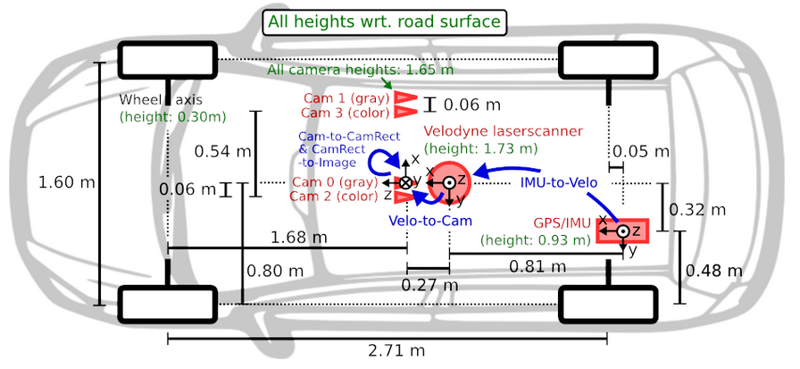
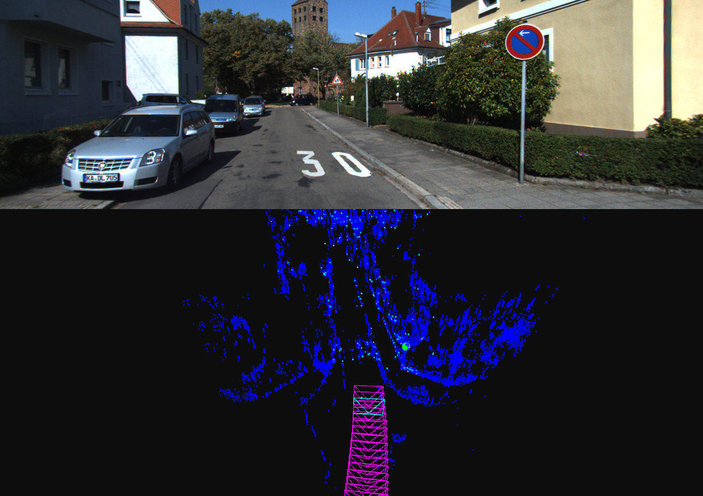

# streetDaM

street related Detection and Mapping - Sviluppo di un sistema per la mappatura visuale di [lampade/alberi/cartelli stradali] a partire da una sequenza di immagini fisse.

Progetto realizzato per l'esame di Laboratorio di Intelligenza Artificiale per la Facoltà di Ingegneria Informatica dell'Università Sapienza di Roma

Dataset: https://www.cvlibs.net/datasets/kitti/eval_odometry.php

Ho sviluppato una pipeline classica per il Simultaneous Localization and Mapping (SLAM), integrandola con YOLOv8 per l'object detection.

Il dataset impiegato è KITTI Odometry, che, pur fornendo anche dati LiDAR, è stato utilizzato qui esclusivamente per le immagini stereo RGB. Questo mi ha permesso di implementare una stima della profondità tramite disparity map. Per la rilevazione delle feature, ho scelto algoritmi consolidati come SIFT e ORB, mentre la trasformazione tra i frame è determinata attraverso il metodo PnP (Perspective-n-Point) con RANSAC.

Attualmente, i risultati sono soddisfacenti ma non ottimali. Questo è dovuto principalmente alla presenza di drift nell'errore di localizzazione, causato dalla mancanza di algoritmi di backend per la correzione degli errori accumulati. Per migliorare le performance e ridurre il drift, ho in programma di esplorare tecniche come il Graph-Based SLAM, loop closure detection, bundle adjustment e Kalman filters.

---

*WIP*

Ubuntu 24.04 LTS
Python 3.9
per la visualizzazione: https://github.com/uoip/pangolin
